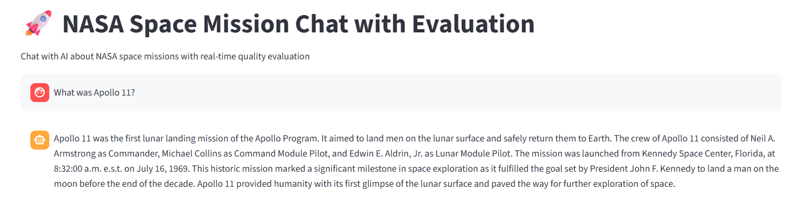
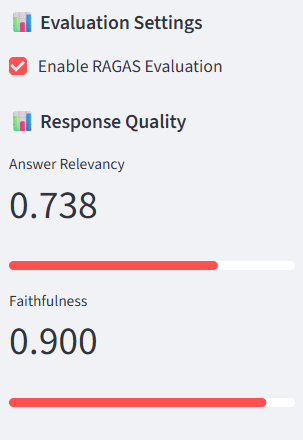
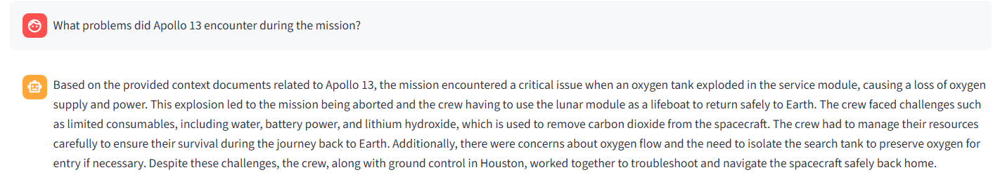
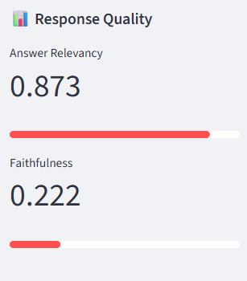
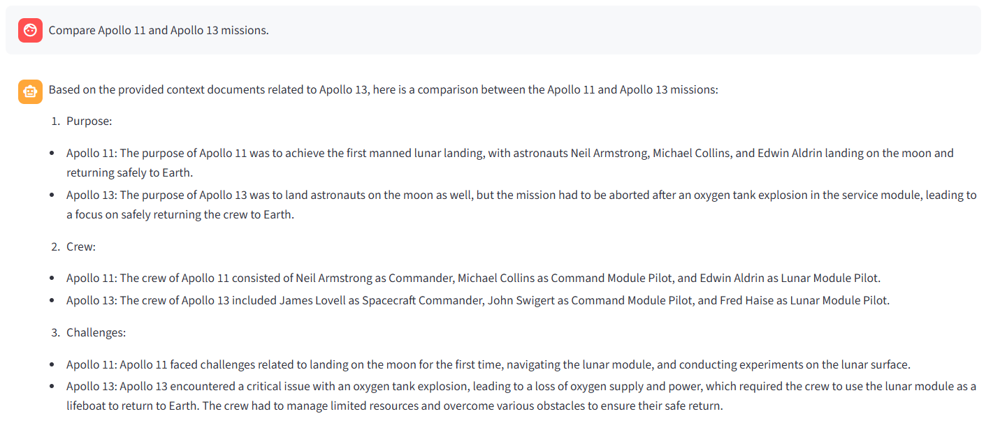
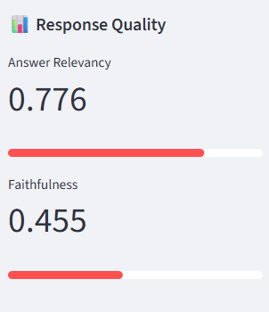
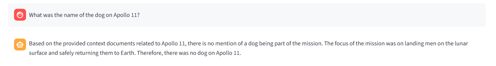
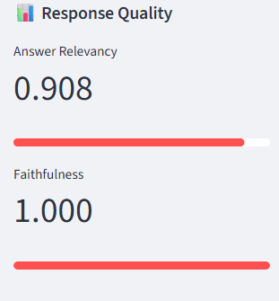

# NASA RAG Chat Project - Student Learning Version

A hands-on learning project for building a Retrieval-Augmented Generation (RAG) system with real-time evaluation capabilities. This project teaches students to create a complete RAG pipeline from document processing to interactive chat interface.

## 🎯 Learning Objectives

By completing this project, students will learn to:
- Build document embedding pipelines with ChromaDB and OpenAI
- Implement RAG retrieval systems with semantic search
- Create LLM client integrations with conversation management
- Develop real-time evaluation systems using RAGAS metrics
- Build interactive chat interfaces with Streamlit
- Handle error scenarios and edge cases in production systems

## 📁 Project Structure

```
/
├── chat.py                 # Main Streamlit chat application (TODO-based)
├── embedding_pipeline.py   # ChromaDB embedding pipeline (TODO-based)
├── llm_client.py           # OpenAI LLM client wrapper (TODO-based)
├── rag_client.py           # RAG system client (TODO-based)
├── ragas_evaluator.py      # RAGAS evaluation metrics (TODO-based)
├── requirements.txt        # Python dependencies
└── README.md              # This file
```

## 🚀 Getting Started

### Prerequisites
- Python 3.10+
- OpenAI API key
- Basic understanding of Python, APIs, and vector databases
- Familiarity with machine learning concepts

### Installation

1. **Navigate to the project folder**:
   ```bash
   cd project
   ```

2. **Install dependencies**:
   ```bash
   pip install -r requirements.txt
   ```

3. **Set up your OpenAI API key**:
   ```bash
   export OPENAI_API_KEY="your-api-key-here"
   ```
   **Or insert in .env file OpenAI API key**:
   ```bash
   OPENAI_API_KEY="YOUR_API_KEY"
   ```


## 🧪 Testing Your Implementation

### **Component Testing**

1. **Test LLM Client**:
   ```python
   from llm_client import generate_response
   response = generate_response(api_key, "What was Apollo 11?", "", [])
   print(response)
   ```
   **The Result:**
   ```text
   Apollo 11 was the first manned mission to land on the Moon. It was launched by NASA on July 16, 1969, and the spacecraft successfully landed on the Moon on July 20, 1969. Astronauts Neil Armstrong and Edwin "Buzz" Aldrin became the first humans to walk on the lunar surface, while Michael Collins remained in lunar orbit aboard the Command Module. This historic mission marked a significant achievement in space exploration and the space race between the United States and the Soviet Union.
   ```

2. **Test RAG Client**:
   ```python
   from rag_client import discover_chroma_backends
   backends = discover_chroma_backends()
   print(backends)
   ```
   **The Result:**
   ```text
   {}
   ```

3. **Test Embedding Pipeline**:
   ```bash
   python embedding_pipeline.py --openai-key YOUR_KEY --stats-only
   ```
   **The Result:**
   ```bash
   2026-05-04 14:15:55,910 - INFO - Initializing ChromaDB Embedding Pipeline...
   2026-05-04 14:15:58,557 - INFO - Collection Statistics:
   2026-05-04 14:15:58,557 - INFO - error: No documents in collection

   ```

4. **Test Evaluation**:
   ```python
   from ragas_evaluator import evaluate_response_quality
   
   question = "What was Apollo 11?"
   
   answer = """
   Apollo 11 was the NASA mission that first landed humans on the Moon. 
   The mission carried astronauts Neil Armstrong, Buzz Aldrin, and Michael Collins. 
   Armstrong and Aldrin landed on the lunar surface in the Lunar Module Eagle, while Collins remained in lunar orbit in the Command Module Columbia.
   """
   
   contexts = [
       """
   Apollo 11 was the first crewed mission to land on the Moon. 
   The mission was launched by NASA in July 1969. 
   The crew consisted of Neil A. Armstrong, Michael Collins, and Edwin E. "Buzz" Aldrin Jr.
   """,
       """
   During Apollo 11, the Lunar Module Eagle landed on the Moon while the Command Module Columbia remained in lunar orbit. 
   Neil Armstrong and Buzz Aldrin walked on the lunar surface, while Michael Collins piloted the command module.
   """
   ]
   
   scores = evaluate_response_quality(
       question=question,
       answer=answer,
       contexts=contexts
   )
   
   print(scores)
   ```
   **The Result:**
   ```bash
   {'answer_relevancy': 0.7040673318539703, 'faithfulness': 0.75}
   ```

### **Integration Testing**

1. **Run the complete pipeline**:
   ```bash
   # Process documents
   python embedding_pipeline.py --openai-key YOUR_KEY --data-path ./data_text
   
   # Launch chat interface
   streamlit run chat.py
   ```
   **The Result of embedding_pipeline.py:**
   ```text
   In file chroma_embedding_text_only.log
   ```


   The link of [chroma_db_openai](https://drive.google.com/drive/folders/1VEEnyz_CVrsCe9f7XycvnZsUpqg7J2c7?usp=sharing)

###  **Test Chat**:

1. **Question:** What was Apollo 11?

   * **Answer**: Apollo 11 was the first lunar landing mission of the Apollo Program. It aimed to land men on the lunar surface and safely return them to Earth. The crew of Apollo 11 consisted of Neil A. Armstrong as Commander, Michael Collins as Command Module Pilot, and Edwin E. Aldrin, Jr. as Lunar Module Pilot. The mission was launched from Kennedy Space Center, Florida, at 8:32:00 a.m. e.s.t. on July 16, 1969. This historic mission marked a significant milestone in space exploration as it fulfilled the goal set by President John F. Kennedy to land a man on the moon before the end of the decade. Apollo 11 provided humanity with its first glimpse of the lunar surface and paved the way for further exploration of space.

   * **Answer Relevancy**: 73.8%

   * **Faithfulness**: 90%

   

   


2. **Question:** What problems did Apollo 13 encounter during the mission?

   **Answer**:Based on the provided context documents related to Apollo 13, the mission encountered a critical issue when an oxygen tank exploded in the service module, causing a loss of oxygen supply and power. This explosion led to the mission being aborted and the crew having to use the lunar module as a lifeboat to return safely to Earth. The crew faced challenges such as limited consumables, including water, battery power, and lithium hydroxide, which is used to remove carbon dioxide from the spacecraft. The crew had to manage their resources carefully to ensure their survival during the journey back to Earth. Additionally, there were concerns about oxygen flow and the need to isolate the search tank to preserve oxygen for entry if necessary. Despite these challenges, the crew, along with ground control in Houston, worked together to troubleshoot and navigate the spacecraft safely back home.

   **Answer Relevancy**: 87.3%

   **Faithfulness**: 22.2%

   

   

3. **Question:** Compare Apollo 11 and Apollo 13 missions.


**Answer**:
   * Purpose:
     * Apollo 11: The purpose of Apollo 11 was to achieve the first manned lunar landing, with astronauts Neil Armstrong, Michael Collins, and Edwin Aldrin landing on the moon and returning safely to Earth.
     * Apollo 13: The purpose of Apollo 13 was to land astronauts on the moon as well, but the mission had to be aborted after an oxygen tank explosion in the service module, leading to a focus on safely returning the crew to Earth.
   * Crew:
     * Apollo 11: The crew of Apollo 11 consisted of Neil Armstrong as Commander, Michael Collins as Command Module Pilot, and Edwin Aldrin as Lunar Module Pilot.
     * Apollo 13: The crew of Apollo 13 included James Lovell as Spacecraft Commander, John Swigert as Command Module Pilot, and Fred Haise as Lunar Module Pilot.
   * Challenges:
     * Apollo 11: Apollo 11 faced challenges related to landing on the moon for the first time, navigating the lunar module, and conducting experiments on the lunar surface.
     * Apollo 13: Apollo 13 encountered a critical issue with an oxygen tank explosion, leading to a loss of oxygen supply and power, which required the crew to use the lunar module as a lifeboat to return to Earth. The crew had to manage limited resources and overcome various obstacles to ensure their safe return.
   * Distance from Earth:
     * Apollo 11: Specific distance information from Earth is not provided in the context documents for Apollo 11.
     * Apollo 13: The documents mention the distance of Apollo 13 spacecraft from Earth at different points during the mission, such as 73,035 nautical miles and 157,720 nautical miles.
   * In summary, while both Apollo 11 and Apollo 13 were part of NASA's Apollo Program with the goal of landing astronauts on the moon, Apollo 11 successfully achieved this goal, while Apollo 13 faced unexpected challenges that required the crew to abort the lunar landing and focus on a safe return to Earth.

**Answer Relevancy**: 77.6%

**Faithfulness**: 45.5%

 

 
   
4. **Question:** What was the name of the dog on Apollo 11?

   **Answer**:Based on the provided context documents related to Apollo 11, there is no mention of a dog being part of the mission. The focus of the mission was on landing men on the lunar surface and safely returning them to Earth. Therefore, there was no dog on Apollo 11.

   **Answer Relevancy**: 90.8%

   **Faithfulness**: 100%

   

   

